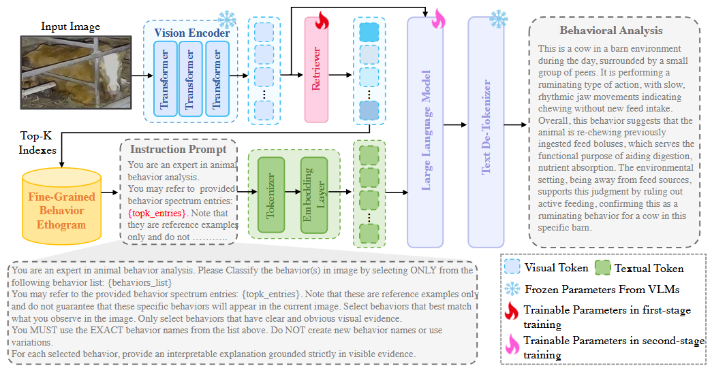
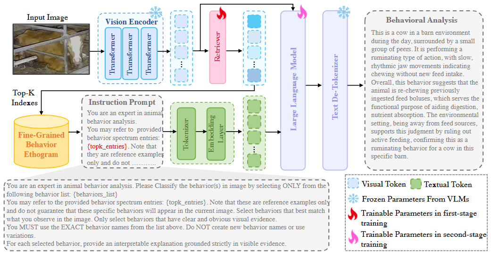

# Knowledge-Guided Interpretable Livestock Behavior Analysis

### with Retrieval-Augmented Reasoning

---

## 📌 Overview



We propose a **knowledge-guided retrieval-augmented reasoning framework** for livestock behavior analysis.
Unlike conventional methods that only predict behavior labels, our approach enables models to **understand and explain *why* behaviors occur**, improving interpretability in real-world farming scenarios.

---

## 💡 Motivation


Existing vision-language models (e.g., CLIP-based approaches) can recognize animal behaviors but fail to provide explanations.

For example:

* A cow lying down could indicate **rest**, **thermal stress**, or **lameness**
* A pig interaction could represent **play**, **aggression**, or **reproductive behavior**

However, traditional models only output labels without reasoning.

👉 Our goal is to move from **“What is the behavior?” → “Why does it occur?”**

---

## 🧩 Key Ideas

Our framework is built upon three key components:

### 1. Fine-grained Behavior Ethogram

* Constructed using domain knowledge (e.g., Wikipedia + multimodal models)
* Each behavior includes:

  * Definition
  * Context cues
  * Visual anchors
  * Negative delimiters

### 2. Explanation-enhanced Supervision

* Automatically generate natural language explanations
* Train models to produce interpretable reasoning

### 3. Retrieval-Augmented Reasoning

* Dynamically retrieve relevant behavior knowledge
* Inject into model prompts for improved reasoning

---

## 🧱 Method Overview



We construct structured behavior knowledge and use a lightweight retriever to inject relevant knowledge into vision-language models, enabling **knowledge-guided reasoning**.

---

## 📊 FLBE Dataset

We introduce the **Fine-grained Livestock Behavior Explanation (FLBE)** dataset, the first large-scale benchmark with explanation annotations.

| Dataset      |     #Images | #Actions | Source         | Scenario      | Labels | Long-tail | Explanation |
| ------------ | ----------: | -------: | -------------- | ------------- | ------ | --------- | ----------- |
| FLBE-Pig     |      55,165 |        6 | Web + Industry | Pen / Cage    | Multi  | ✓         | ✓           |
| FLBE-Cow     |      62,424 |        7 | Surveillance   | Day & Night   | Multi  | ✓         | ✓           |
| FLBE-Sheep   |      14,455 |        5 | Grazing        | Outdoor       | Multi  | ✓         | ✓           |
| FLBE-Chicken |      35,234 |        7 | Web            | Poultry House | Multi  | ✓         | ✓           |
| **Total**    | **167,278** |        — | Mixed          | Diverse       | Multi  | ✓         | ✓           |

---

## 📈 Results

### Behavior Recognition

| Model         | Pig Acc | Chicken Acc | Sheep Acc | Cow Acc |
| ------------- | ------- | ----------- | --------- | ------- |
| Qwen2.5-VL-3B | 0.5675  | 0.3687      | 0.4413    | 0.6755  |
| + Ours        | 0.5865  | 0.8090      | 0.8430    | 0.7529  |
| Qwen3-VL-2B   | 0.5715  | 0.3920      | 0.4581    | 0.6845  |
| + Ours        | 0.6126  | 0.8253      | 0.8682    | 0.7757  |

### Explanation Quality

| Model         | Pig (NLI) | Chicken (NLI) | Sheep (NLI) | Cow (NLI) |
| ------------- | --------- | ------------- | ----------- | --------- |
| Qwen2.5-VL-3B | 44.36     | 28.15         | 33.86       | 32.70     |
| + Ours        | 50.81     | 36.67         | 45.02       | 39.87     |

👉 Our method consistently improves both **recognition accuracy** and **explanation quality** across all datasets.

For full results, please refer to our paper.

---

## 🎯 Qualitative Results


Compared to baseline models, our method generates:

* More accurate behavior predictions
* More coherent and grounded explanations
* Less hallucination

---

## 🏆 Contributions

* Introduce interpretable livestock behavior analysis framework
* Propose retrieval-augmented reasoning for VLMs
* Construct the FLBE dataset with explanation annotations

---

## 📄 Paper

📎 [PDF Link Coming Soon]

---

## 📌 Citation

```bibtex
@article{yourname2025livestock,
  title={Knowledge-Guided Interpretable Livestock Behavior Analysis with Retrieval-Augmented Reasoning},
  author={...},
  journal={...},
  year={2025}
}
```

---

## ⭐ Acknowledgement

This project is developed for advancing **interpretable AI in precision livestock farming**.
